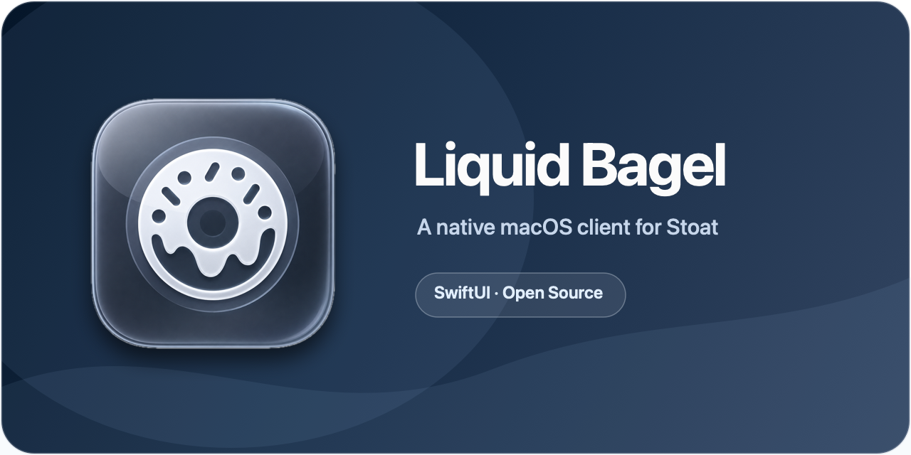

# Liquid Bagel

<p align="center">
  
</p>

Liquid Bagel is an unofficial, native macOS client for [Stoat](https://stoat.chat). It is built with SwiftUI and connects directly to Stoat's REST and realtime APIs—no Electron and no webview.

> [!WARNING]
> **Liquid Bagel is a pre-release and is still unpolished.** Expect missing features, rough edges, and bugs. Do not rely on it as your only way to access Stoat.

Liquid Bagel covers the essentials of day-to-day chat: servers and channels, direct and group messages, friends, roles, moderation tools, custom emoji, attachments, reactions, replies, native notifications, and profile editing.

## Requirements

- macOS 15 or newer
- A Stoat account — you can [create one at stoat.chat](https://stoat.chat)

## Download and Install

1. Download the DMG from the [latest GitHub release](https://github.com/Kusanalee/Liquid-Bagel/releases/latest).
2. Open the DMG and drag **Liquid Bagel** into **Applications**.
3. Open **Liquid Bagel** from your Applications folder.

### If macOS Says the App Cannot Be Opened

Liquid Bagel is not signed with an Apple Developer ID or notarized, so Gatekeeper will warn you before the first launch. Only continue if you downloaded the DMG from this repository and are comfortable running an unsigned pre-release.

1. Try opening the app once, then dismiss the warning.
2. Open **System Settings → Privacy & Security**.
3. Scroll to **Security**, find the message about Liquid Bagel, and click **Open Anyway**.
4. Confirm by clicking **Open**. You should only need to do this once.

Liquid Bagel is open source under the [MIT License](LICENSE), so you can inspect the code and build the app yourself before signing in. See [Build from Source](#build-from-source).

## Getting Started

1. Launch Liquid Bagel and sign in with your Stoat email and password. If your account uses two-factor authentication, you will be asked for a code next.
2. Wait for the app to connect and load your conversations.
3. Use the server list, channel list, or direct messages to start chatting.

Your session token is stored in the macOS Keychain and scoped to Liquid Bagel. It is never logged or sent to diagnostics. On later launches, the app re-validates the saved session and reconnects automatically.

## Features

- **Servers & channels**: browse, create, and manage servers, channels, and categories.
- **Messaging**: send/edit/delete messages, replies, reactions, mentions, and rich markdown rendering.
- **Direct messages**: 1:1 and group DMs with conversation parity to the official client.
- **Friends & relationships**: friend requests, blocking, and profile popovers.
- **Members & roles**: member lists with live role colors, role assignment, and permission-guarded moderation actions.
- **Moderation**: kicks, bans, slowmode, and server/channel administration.
- **Media**: attachment upload, clipboard paste/drag-and-drop, inline image previews, avatars, server icons and banners, and custom emoji (including cross-server emoji).
- **Notifications**: native macOS notifications, dock badges, and per-server/channel notification preferences.
- **Offline mode**: your servers, channels, and recent messages are saved on-device and available immediately at launch, even with no connection. Content is encrypted at rest and removed when you sign out.
- **Settings sync**: appearance and notification preferences follow your account across devices automatically.
- **Account & identity**: profile and account editing, session/account management, and status.
- **Native macOS**: a SwiftUI app that follows system appearance, window, and interaction conventions rather than reskinning a web client.

## Current Limitations

Liquid Bagel intentionally does not include:

- **Video or screen share.** Not implemented. Voice chat is supported (join/leave, mute/deafen, push-to-talk, device selection).
- **Background push notifications.** Notifications are delivered while Liquid Bagel is running; there is no push when the app is quit.

This list is not exhaustive. Because this is an early pre-release, features that exist may still behave incorrectly. Please report reproducible problems through [GitHub Issues](https://github.com/Kusanalee/Liquid-Bagel/issues).

## Build from Source

Building requires Xcode 26.5 or newer and the Swift 6 toolchain.

```bash
git clone https://github.com/Kusanalee/Liquid-Bagel.git
cd Liquid-Bagel
xcodebuild -project LiquidBagel.xcodeproj -scheme LiquidBagel -destination 'platform=macOS' build
```

To run the full automated test and build gate:

```bash
Scripts/check.sh
```

The check script tests every local Swift package, verifies that test doubles have not leaked into shipping source code, and builds the macOS app.

## Project Structure

- `App/`: macOS SwiftUI app shell (window, commands, app lifecycle).
- `Packages/StoatModels`: core Stoat value models, ID wrappers, config decoding, and permission bitmasks.
- `Packages/StoatAPI`: REST API environment, auth credentials, Keychain-backed token storage, request/response handling, upload scaffolding, and the live API client.
- `Packages/StoatRealtime`: realtime WebSocket client, event decoding, diagnostics, and state store.
- `Packages/StoatPersistence`: app preferences, environment profiles, and the local cache repository boundary.
- `Packages/StoatDesignSystem`: shared styling tokens and components (the app's glass/native visual language).
- `Packages/StoatUI`: chat shell UI — timeline, composer, markdown rendering, embeds, and shared chat components.
- `Packages/StoatVoice`: voice call transport — a `VoiceEngine` abstraction backed by the LiveKit Swift SDK, isolated from the rest of the app so the WebRTC dependency doesn't leak into every package's build graph.
- `Packages/StoatFeatures`: feature layer (view models, coordinators, and screen-level logic) used by the app target.
- `Docs/Research.md`: Stoat API/protocol research notes.
- `Docs/PhaseN.md` (phases 1–75): phase-by-phase implementation history and handoff notes.
- `Docs/QA/`: manual QA pass notes for release gates (freeze/perf, chat presentation, conversation state, notifications, account/identity, community management, native macOS behavior).

See [Docs/Phase75.md](Docs/Phase75.md) for the most recent architecture notes and [Docs/QA/](Docs/QA/) for release-gate QA coverage.

## Contributing

This project is under active development (see `Docs/Phase*.md` for history). Before opening a PR:

1. Run `Scripts/check.sh` locally — it must pass (all package tests, the test-double gate, and the app build).
2. Keep test doubles inside test targets; don't add `Mock`/`Stub`/`Fake` types to `Packages/*/Sources` or `App`.
3. Add a short `Docs/PhaseN.md` note for notable changes, following the existing phase-log convention.

## License

Liquid Bagel is available under the [MIT License](LICENSE).
